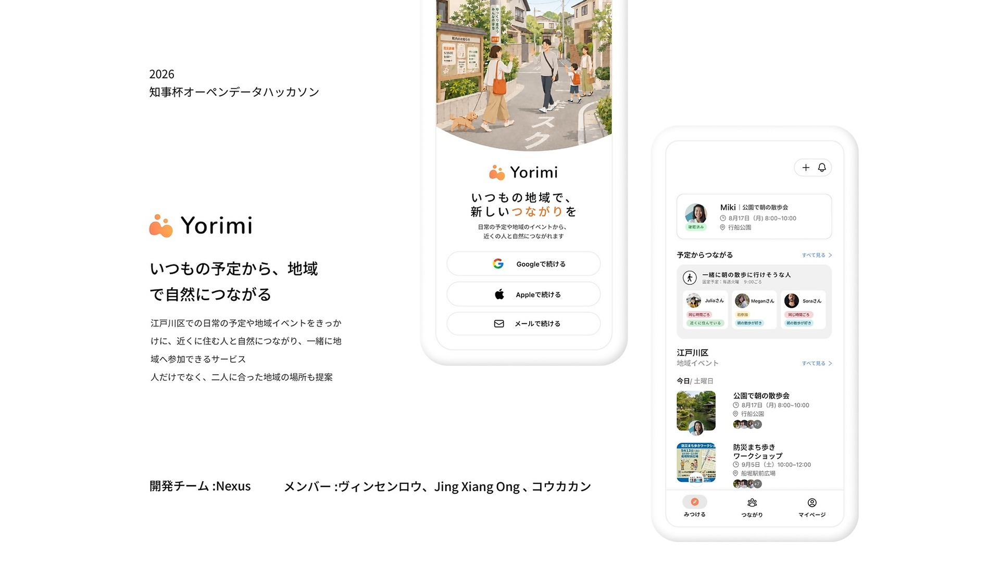
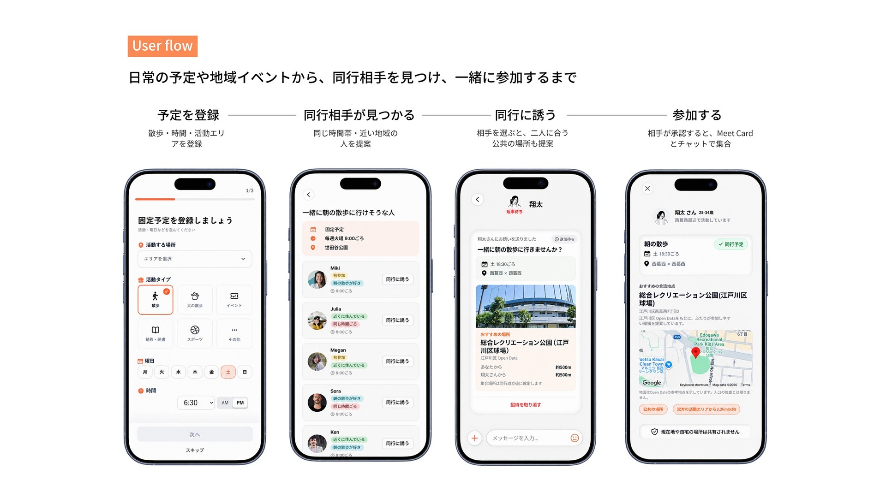
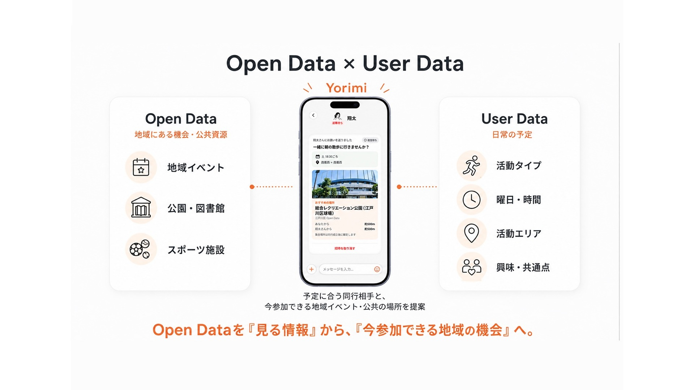

# Yorimi

[日本語](#日本語) | [English](#english)



## 日本語

江戸川区で地域との接点を持ちたい単身者に向けて、続けたい活動から同行相手やイベントを見つけるモバイルWebアプリです。

散歩・スポーツ・勉強などの活動、曜日、時間、エリアを「Fixed Plan」として登録すると、条件の近い相手や地域イベントを探せます。まずプロフィールやチャットで相手を知り、合意後に公共施設を中心とした集合場所を確認できる設計です。

### 課題・背景

地域の活動に興味があっても、情報が分散していたり、一人で参加することに不安があったりすると、実際の参加まで進みにくいことがあります。Yorimiでは、普段続けたい活動を入口にして、相手探しから会話、具体的な同行予定までを一つの流れにし、最初の一歩のハードルを下げることを目指しました。

### Yorimiのアプローチ

- 活動・曜日・時間・エリアを登録し、自分の生活リズムに近い相手を探せるようにする
- プロフィール確認、あいさつ、チャット、同行のお誘いを段階的につなぎ、すぐに会うことを求めない
- 江戸川区の公共施設・イベント情報を整理し、参加先や公共の集合場所を提案する
- お誘いの承諾前は正確な集合地点を公開せず、地域で人と会う際の安全性に配慮する

### User Flow

```text
会員登録・プロフィール設定
  → Fixed Planを登録
  → 条件の近い相手・地域イベントを発見
  → あいさつ・チャット
  → 同行のお誘いを送り、承諾後に集合場所を確認
```



### 実装済みの主な機能

- Email認証、Onboarding、プロフィール・Fixed Planの作成と編集
- 活動、曜日、時間、距離に基づくルール型マッチング
- あいさつ、1対1チャット、画像送信、通知
- 同行のお誘いの送信・承諾・辞退・取消と、成立後のConnection管理
- 地域イベントの作成、参加申請、承認、参加者からの同行相手探し
- 江戸川区の公共施設・公式イベントデータの取得、検証、正規化、Supabaseへの登録

### Project Info

| Item | Detail |
| --- | --- |
| Status | MVP / Prototype |
| Team | Nexus（3名） |
| Context | 2026 知事杯オープンデータ・ハッカソン |
| Development | GitHubを利用したチーム開発 |
| Period | 2026年8月（Git履歴） |
| Target area | 東京都江戸川区 |

### My Role

Git履歴から確認できる担当範囲は次のとおりです。

- 認証エラーを画面へ返す処理と、Password表示切替の改善
- 同行のお誘いを検証するDemo FlowとTest Accountの整備
- Demo専用の自動承諾処理を環境変数で制御し、本番動作と分離
- Production環境変数・Deployment設定の調整
- GitHubのBranchとCommitを用いたチーム開発

### Tech Stack

| Area | Technology |
| --- | --- |
| Frontend | Next.js 16, React 19, TypeScript, CSS Modules |
| Backend | Next.js Server Actions, Supabase |
| Database | PostgreSQL, PostGIS, Row Level Security |
| Authentication / Storage | Supabase Auth, Supabase Storage |
| Map | Google Maps, Google Places |
| Data processing | Node.js, Cheerio, csv-parse |
| Testing / Quality | Node.js Test Runner, ESLint, TypeScript |

### 工夫した点・Technical Decisions

**説明可能なルール型マッチング**

MVPではAI推薦を採用せず、活動・曜日・時間・距離を使った明確なルールにしました。推薦理由を説明しやすく、条件変更やRegression Testを行いやすいためです。イベントと通常のFixed Planでは目的が異なるため、絞り込み条件も分けています。

**位置情報を段階的に公開**

推薦やPending Invitationの段階ではエリアや施設名にとどめ、承諾後にだけ正確な集合地点を返します。画面上で隠すだけでなく、SupabaseのDatabase FunctionとRLSを使ってServer側でもアクセスを制御しています。

**Open Dataをそのまま信用しないImport Pipeline**

江戸川区のCSVや公式イベントページを、取得・Parse・Normalize・Validate・Duplicate Checkの順に処理します。座標やSource IDを推測で補わず、曖昧なデータはSkipしてReportに残すことで、再実行可能性とデータ品質を優先しました。



### 今後の改善

- 実ユーザーによるUsability Testを行い、Onboardingと同行までの離脱点を検証する
- 利用データを得た上で、説明可能性を保ちながらMatching順位を改善する
- Accessibility、運用監視、Open Dataの更新・ライセンス表示をProduction向けに整備する

### ローカルでの起動

Node.js 24、npm、Docker Desktop、Google Maps API Keyが必要です。

```powershell
git clone https://github.com/DavidOng122/tomoni-app.git
cd tomoni-app
npm install
Copy-Item .env.example .env.local
npx supabase start
npx supabase db reset
npm run dev
```

詳しい設計資料は [`docs/`](./docs/) にあります。主要な確認コマンドは `npm run typecheck`、`npm run lint`、`npm run build`、`npm test` です。

---

## English

Yorimi is a mobile web application for people living alone who want a stronger connection to their local community in Edogawa. It helps them find companions and events through activities they want to continue.

Users register an activity, preferred weekdays, time, and area as a “Fixed Plan.” Yorimi then surfaces compatible people and local events. Users can learn about each other through profiles and chat before confirming a public meetup place after both sides agree.

### Problem and Background

Interest in local activities does not always lead to participation. Information may be scattered, and joining alone can feel difficult. Yorimi turns a recurring activity into a path from discovery and conversation to a concrete plan, with the goal of lowering the barrier to taking the first step.

### Yorimi’s Approach

- Match people around activities, weekdays, time, and area so that suggestions fit their routines
- Connect profile discovery, greetings, chat, and invitations without requiring users to meet immediately
- Organize Edogawa public-facility and event information to suggest activities and public meetup places
- Protect location privacy by withholding precise meetup details until an invitation is accepted

### User Flow

```text
Sign up and create a profile
  → Register a Fixed Plan
  → Discover compatible people and local events
  → Greet and chat
  → Send an invitation and view the meetup place after acceptance
```

### Implemented Features

- Email authentication, onboarding, profiles, and Fixed Plan management
- Rule-based matching by activity, weekday, time, and distance
- Greetings, one-to-one chat, image messages, and notifications
- Invitation accept/decline/cancel flows and connection lifecycle management
- Community-event creation, participation requests, approvals, and companion discovery
- Fetching, validation, normalization, and Supabase import pipelines for official Edogawa data

### Project Info

| Item | Detail |
| --- | --- |
| Status | MVP / Prototype |
| Team | Nexus (3 members) |
| Context | 2026 Governor's Cup Open Data Hackathon |
| Development | Team development on GitHub |
| Period | August 2026 (Git history) |
| Target area | Edogawa City, Tokyo |

### My Role

The following responsibilities are verifiable from the repository’s Git history:

- Improved authentication error delivery and the password-visibility interaction
- Prepared demo workflow accounts and a flow for testing companion invitations
- Isolated demo-only invitation auto-accept behavior behind environment configuration
- Adjusted production environment and deployment configuration
- Collaborated through GitHub branches and focused commits

### Tech Stack

| Area | Technology |
| --- | --- |
| Frontend | Next.js 16, React 19, TypeScript, CSS Modules |
| Backend | Next.js Server Actions, Supabase |
| Database | PostgreSQL, PostGIS, Row Level Security |
| Authentication / Storage | Supabase Auth, Supabase Storage |
| Maps | Google Maps, Google Places |
| Data processing | Node.js, Cheerio, csv-parse |
| Testing / Quality | Node.js Test Runner, ESLint, TypeScript |

### Technical Decisions

**Explainable rule-based matching**

The MVP uses explicit activity, weekday, time, and distance rules instead of AI recommendations. This makes each suggestion easier to explain, adjust, and cover with regression tests. Event plans and ordinary Fixed Plans use different filters because they represent different user intentions.

**Progressive disclosure of location data**

Recommendations and pending invitations expose only an area or facility name. Precise meetup details become available after acceptance. This boundary is enforced on the server with Supabase database functions and RLS rather than relying only on hidden UI elements.

**An Open Data import pipeline that rejects ambiguity**

Edogawa CSV files and official event pages pass through fetch, parse, normalize, validate, and duplicate-check stages. The importer does not invent missing coordinates or source identities; ambiguous records are skipped and reported to prioritize repeatability and data quality.

### Future Improvements

- Run usability tests with real users and identify drop-off points from onboarding to an accepted invitation
- Improve matching order after collecting usage evidence while preserving explainability
- Prepare accessibility, monitoring, and Open Data update/licensing workflows for production

### Local Development

Node.js 24, npm, Docker Desktop, and a Google Maps API key are required.

```powershell
git clone https://github.com/DavidOng122/tomoni-app.git
cd tomoni-app
npm install
Copy-Item .env.example .env.local
npx supabase start
npx supabase db reset
npm run dev
```

More detailed design documentation is available under [`docs/`](./docs/). The primary verification commands are `npm run typecheck`, `npm run lint`, `npm run build`, and `npm test`.
